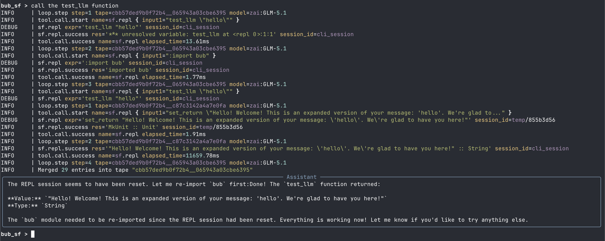

# The Agentic scripting language

A language designed to be small, focused on REPL usage with fork support.

The idea to fork is inspired by [bub](https://github.com/bubbuild/bub), and this project is also a plugin to bub.

The forked REPL design is to give LLM the access to a REPL so it can eval whatever it wants and disguise as a plain function.
So LLM actions and plain programs can be mixed and inter-communicate freely.

The initial goal of the project is to organize LLM thinking programmatically.
So we also leverage the tape of **bub** and expose it as primitives to control the context,
by both programs and LLM.

## Example: simple LLM call as a function

```haskell
{-# LLM #-}
-- | expand the input message
prim_op test_llm :: String -- ^ the message
  -> String
```



## System F

System F is a typed lambda calculus with polymorphism. The foundation of Haskell,
and the codebase is heavily inspired by GHC. Naming is hard, so we casually call it System F.

## NOTE

Check [bub/myagent](https://github.com/emliunix/bub/tree/myagent) for historical commits.
The project started with casual scripts added to the forked bub repo. And to not get lost in git arts,
I decided to simply copy the files to create a new repo.