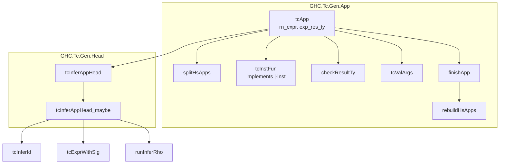
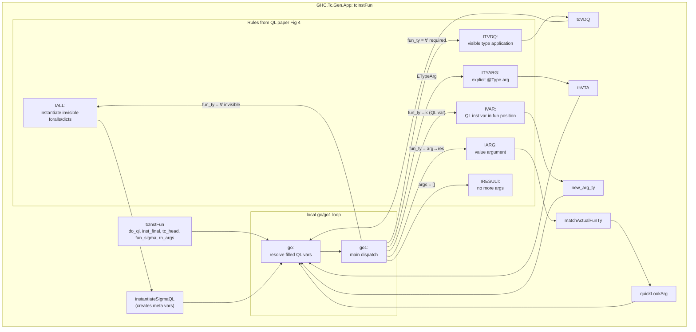
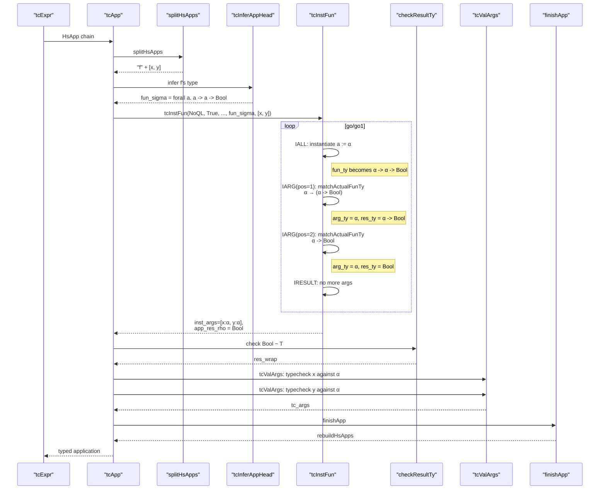

# GHC Typechecker Call Hierarchy: `tcApp` / `tcInstFun`

**Scope**: Only the application typechecking chain starting from `tcApp`.  
Other explored functions (case expressions, bindings, skolemisation) are general typechecker machinery and NOT called from `tcApp`/`tcInstFun`.

---

## 1. `tcApp` Top-Level Flow

---

## 2. `tcInstFun` Internal Dispatch

---

## 3. Sequence: `f x y :: T` (NoQL path)

---

## 4. `tcInstFun` Rules Summary

| Rule | Condition | Action | Creates |
|------|-----------|--------|---------|
| **IALL** | `fun_ty = ∀ invisible. body` | `instantiateSigmaQL` | Meta vars for `∀`, wanted dicts for `=>` |
| **ITVDQ** | `fun_ty = ∀ required. body` + value arg | `tcVDQ` | Substitutes visible type arg |
| **ITYARG** | `ETypeArg @T` | `tcVTA` | Explicit type application |
| **IVAR** | `fun_ty = κ` (unfilled QL inst var) | `new_arg_ty` | Sets `κ := ν₁ → ... → νₙ → res` |
| **IARG** | `fun_ty = arg_ty → res_ty` | `matchActualFunTy` + `quickLookArg` | Extracts arg/res, checks arg |
| **IRESULT** | `args = []` | return | Final result type |

---

## 5. NOT in `tcApp`/`tcInstFun` Chain

These were explored in previous research but are **general expression handlers**, NOT called from `tcApp`:

| Function | Purpose | Entry Point |
|----------|---------|-------------|
| `tcExpr HsCase` | Typecheck `case` expressions | `tcExpr` dispatch |
| `tcCaseMatches` | Match groups for case | Called by `tcExpr HsCase` |
| `tcMatches` / `tcMatch` | Pattern match checking | Called by `tcCaseMatches`, `tcFunBindMatches` |
| `tcPat` / `tcConPat` | Pattern typechecking | Called by `tcMatch` |
| `tcTopBinds` / `tcLocalBinds` | Let/where bindings | `tcExpr` for `HsLet`, `tcTopBinds` for top level |
| `tcPolyBinds` | Polymorphism dispatch | `tcBindGroups` |
| `topSkolemise` | Skolemise expected type | `matchExpectedFunTys`, signature checking |
| `tcInstSkolTyVars` | Create skolem vars | `topSkolemise`, `skolemiseRequired` |
| `topInstantiate` | Instantiate with meta vars | Various (NOT `tcInstFun` — `tcInstFun` uses `instantiateSigmaQL`) |

---

## File Locations

| Function | Module | Line |
|----------|--------|------|
| `tcApp` | `GHC.Tc.Gen.App` | 353 |
| `tcInstFun` | `GHC.Tc.Gen.App` | 607 |
| `tcInferAppHead` | `GHC.Tc.Gen.Head` | 522 |
| `instantiateSigmaQL` | `GHC.Tc.Gen.App` | ~900 |
| `matchActualFunTy` | `GHC.Tc.Utils.Unify` | various |
| `tcValArgs` | `GHC.Tc.Gen.App` | ~1100 |
| `checkResultTy` | `GHC.Tc.Utils.Unify` | various |
