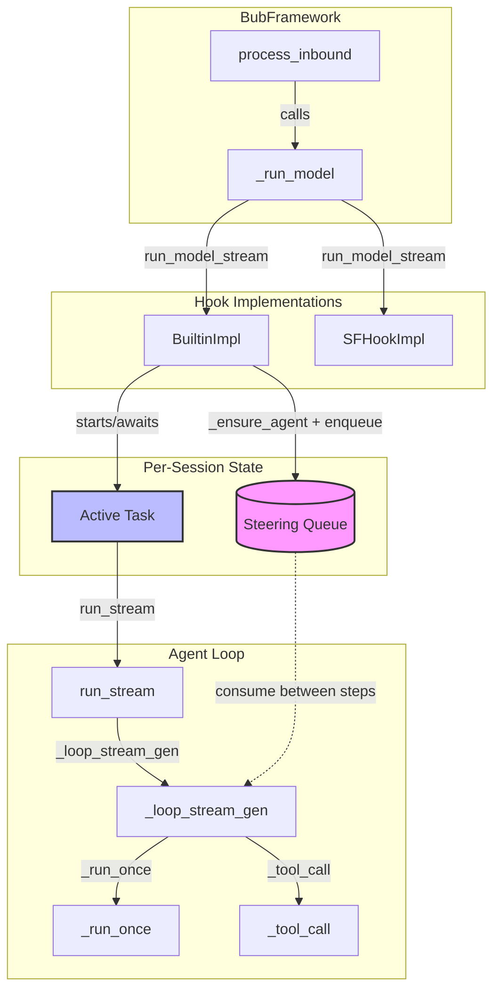

# 59: Steering Message Support

**Date:** 2026-05-23
**Status:** Design in progress
**Area:** `bub/src/bub/builtin/agent.py`, `bub/src/bub/builtin/hook_impl.py`

## Raw Design Input

> - the extension point is at run_stream_model hook
> - there' will be a queue bound to a session
> - and instead of calling the agent directly with the message
> - the message is put into the queue
> - and we call _ensure_agent() to ensure agent call is live for this session

> So what we do is to pass a queue direct into the agent loop for it to check if any message needs to be consumed immediately
> and that means we'll deprecate the serialization design which blocks the message

## What it's NOT

This is **not** per-session message serialization (changes/56). Change 56 proposed an external queue with `_ensure_agent()` workers that serialize turns one at a time. Steering is the opposite: the queue is passed **into** the active agent loop so messages are consumed mid-turn, not between turns. The `_ensure_agent()` worker pattern was never implemented and is superseded by this design.

## Problem

Agent loops run for minutes across multiple steps. Corrections sent mid-loop must reach the running loop immediately, not queue until the turn finishes.

Additionally, the framework has no session-level serialization: each inbound message triggers a fresh `run_model_stream` hook call. Without a singleton guard, concurrent messages for the same session would spawn multiple agent loops racing on the same tape.

## Architecture

### Component Diagram

### Two-Layer Design

Steering requires **two coordinated mechanisms**:

1. **Session Singleton (`_ensure_agent`)**: Ensures only one agent loop runs per session. New messages during an active loop are converted to steering messages instead of starting competing loops.
2. **Intra-Loop Steering Queue**: Passed into the active agent loop. Consumed between steps so steering reaches the LLM on the next turn.

#### Why Both Are Needed

- Without singleton: Two concurrent `run_model_stream` calls → two `Agent.run_stream()` calls → two tape sessions racing on same tape → corruption.
- Without intra-loop queue: Steering messages would queue externally (change 56 style) and only be seen after the current loop finishes.
- With both: New messages during active loop become steering; the active loop consumes them between steps.

### Queue Lifecycle

- Created on-demand per session
- Checked between every step
- Not drained on turn completion — remaining messages stay for the next turn
- Bounded (`maxsize=100`) with drop-oldest on overflow
- `_active_tasks` entry cleaned up via `task.add_done_callback` when loop finishes
- Optional: cleanup `_steering_queues` on session end

## Tape Session State Machine

Reference: `republic/src/republic/tape/session.py` — the `TapeSession` enforces a strict lifecycle via typed state transitions.

### Invariants for Steering Integration

| State | Invariant | Why It Matters for Steering |
|---|---|---|
| **idle** | No `PreparedChat` exists; `_deferred_entries` may be non-empty from previous turn | Steering messages must not be written to tape here — they are ephemeral |
| **prepared** | `PreparedChat` exists but not yet executed; `_apply_prepared()` flushes `prepared.entries` to tape | Steering messages should attach to `PreparedChat.additional_messages`, not `entries`, to avoid tape persistence |
| **toolcallneeded** | `add_tool_results()` rebuilds `PreparedChat` from `needed.result.request` + deferred entries | Steering consumed between `run()` and `add_tool_results()` must be attached to the *next* turn's `PreparedChat` |
| **finish/error** | `_record_result()` or `_record_result_error()` writes final entries; session returns to idle | Any steering arriving here is queued for the *next* loop iteration |

### Tape entry boundaries

We need to ensured key entries are saved atomically and are correctly ordered.

Key entry Kinds:
- user message 
- assistant message
- tool_result
- anchor

**NOTE**: tool_call is not used for building API messages, it's only for commentary. The tool_calls field in assistant message is the one used to build API messages array.

The key is to buffer entries in `PreparedChat`, and that ensures:

- tool generated entries (anchor, messages (user or assistant)) are appended after tool_result. It's implemented in such a way that during tool calling, the messages by tool is buffered to the session, then on add_tool_result, moved to prepared_chat. And later before next API call, the entries are flushed to tape. So included in next API call.
- also the new steering messages are appended after those tool generated entries, by agent loop, operating the prepared_chat.entries directly.

**NOTE**: after we checked the lifecycle, I think we need to refine the workflow that assistant entries should be deferred to save together with tool_result. Otherwise the atomicity of tool_call and tool_result is compromised.

## Facts

| # | Fact | Location |
|---|---|---|
| 1 | Agent loop is multi-step, each step = LLM call + optional tool execution | `agent.py:236-258` |
| 2 | `session.run()` blocks until LLM response completes | `agent.py:243` |
| 3 | `_tool_call()` rebuilds `prepared` via `_prepare_turn()` for next step | `agent.py:341-371` |
| 4 | `run_model_stream` is the framework entry point | `hook_impl.py:168-174` |
| 5 | `session.prepare()` builds the message list sent to LLM | `agent.py:506-515` |
| 6 | `TapeSession` buffers entries until flush | changes/58 |
| 7 | Commands bypass the agent loop | `hook_impl.py:164-166` |
| 8 | `TapeSession.run()` reads messages from tape | `republic/src/republic/tape/session.py:105` |
| 9 | `PreparedChat` carries `additional_messages` for ephemeral additions | This design |
| 10 | `TapeEntry.message()` creates a message entry | `republic/src/republic/tape/entries.py` |

## Claims

| # | Claim | Evidence |
|---|---|---|
| 1 | Steering queue must be passed into the agent loop, not managed externally | Facts 1, 2 |
| 2 | Steering is checked between steps, not within an LLM call | Fact 2 |
| 3 | Steering messages are attached to `PreparedChat` as ephemeral user messages | Facts 5, 9 |
| 4 | `_prepare_turn()` is the injection point | Facts 3, 5 |
| 5 | Queue is bound to session ID, not tape name | Fact 4 |
| 6 | Steering deprecates message serialization (changes/56) | Claim 1 |

## Design Evolution: PreparedChat as Message Carrier

### Problem with Current Design

The current `PreparedChat` explicitly "does NOT contain messages" (per docstring). Messages are always retrieved from tape by `TapeSession.run()`. This creates tight coupling between turns:

1. **Tool call round-trip**: `add_tool_results()` writes to tape → next `prepare()` reads from tape → `run()` reads from tape again
2. **Steering append-and-read**: Steering messages are appended to `session._deferred_entries` → flushed to tape → next `prepare()` reads them back

### Error Recovery Considerations

The key factor determining whether to buffer or directly store entries is **the recovery point**.

**Timeline of entry production:**
1. **Start** — Tape has good state (base case)
2. **LLM returns assistant message** — Write `assistant` entry immediately. If crash here, restart sees the assistant message and continues (no re-execution needed).
3. **LLM returns tool_calls in assistant** — Write `assistant` + `tool_call` entries atomically. The tool_call_id references in the assistant message must be persisted together.
4. **Agent executes tools** — Write `tool_result` entry when each tool completes. If crash after tool execution, restart sees the result and continues without re-executing the tool.
5. **Tool may add additional messages** — These are part of tool output and are written with the tool_result.
6. **In-flight user messages (steering)** — Ephemeral. User can re-send if lost. No recovery needed.

**Why this matters:**
- `assistant` + `tool_call` entries must be written together (atomic) because tool_call_id references in the assistant payload must match the tool_call entries.
- `tool_result` entries must be written individually as tools complete to avoid re-executing expensive tools on crash recovery.
- Steering messages are ephemeral by design. If the agent crashes mid-loop, the user can re-send their correction.

**Real errors to handle:**
1. **Corrupted message format** — Caught by validation before writing to tape.
2. **Unrecoverable context length** — Triggers `NeedHandOffError` (auto-handoff to new tape).

**Why deferred/buffered appending is necessary:**

A critical case that motivated the deferred entry buffer is **handoff during tool execution**:

1. LLM requests tool call → `assistant` + `tool_call` entries produced
2. Agent executes tool → tool may trigger `NeedHandOffError` (context overflow, etc.)
3. Handoff creates a new anchor, truncating the tape context
4. Tool execution completes → `tool_result` entry produced
5. **Problem**: If we wrote entries immediately, the `tool_result` would be appended *after* the handoff anchor, creating a dangling `tool_result` with no matching `tool_call` in the truncated context.

**Solution**: Buffer all entries for the current turn in `_deferred_entries`. Only flush them when the turn completes successfully. If handoff is triggered, discard the buffer and write the handoff anchor instead. This ensures tape integrity: either the full turn (assistant + tool_call + tool_result) is persisted together, or none of it is (handoff case).

**Revised entry persistence strategy:**

| Entry Type | Timing | Persistence |
|---|---|---|
| `message` (user prompt) | `prepare()` | Immediate (tape) |
| `system` | `prepare()` | Immediate (tape) |
| `assistant` | After LLM response | Deferred (buffer until turn completes) |
| `tool_call` | With assistant | Deferred (buffer until turn completes) |
| `tool_result` | After tool execution | Deferred (buffer until turn completes) |
| `event` (telemetry) | Any time | Immediate (tape, non-blocking) |
| `anchor` (handoff) | On handoff trigger | Immediate (discards pending buffer) |
| Steering messages | Between steps | Ephemeral (`PreparedChat.additional_messages`) |
| Tool additional messages | During tool execution | Deferred (with tool_result) or ephemeral |

This means:
- **Deferred entries**: `assistant`, `tool_call`, `tool_result` — buffered until the full turn completes successfully
- **Immediate entries**: `message`, `system`, `event`, `anchor` — written directly
- **Ephemeral**: Steering messages — exist only in `PreparedChat` for current API call

## Consideration Notes

These are the key architectural considerations that shaped this design, preserved for future reference:

### 1. System Prompt Stability

`system_prompt` should be stable and not rebuilt during turn execution. We call it with an empty user prompt to unlink it from the actual prompt content. Rebuilding only at loop start prevents expensive or inconsistent rebuilds mid-loop.

### 2. Error Recovery Points

The key factor determining buffer vs direct storage is the recovery point on crash:

- **User messages** (`prepare()`): Immediate — user can re-send if lost
- **Assistant + tool_call**: Deferred — must be atomic to maintain tool_call_id integrity
- **tool_result**: Deferred — avoid re-executing expensive tools on recovery
- **Steering**: Ephemeral — user can re-send their correction
- **Events**: Immediate — telemetry, no recovery needed

### 3. Handoff and Dangling Entries

This is the primary reason for deferred buffering. If a tool triggers handoff mid-execution:

1. `assistant` + `tool_call` entries are produced
2. Tool execution triggers `NeedHandOffError` → handoff anchor created
3. Context is truncated after the anchor
4. `tool_result` would be appended *after* the truncated context
5. **Result**: Dangling `tool_result` with no matching `tool_call`

**Solution**: Buffer all turn entries. Only flush on successful completion. If handoff triggers, discard buffer and write anchor. This ensures: either the full turn is persisted atomically, or none of it is.

### 4. Tape as Audit Log vs Ephemeral Messages

- **Tape**: Persistent audit log. Every entry is recoverable and replayable.
- **`PreparedChat.additional_messages`**: Ephemeral additions for the current API call only. Not persisted to tape. Used for steering and other transient messages that don't need recovery.

### 5. Session Singleton + Intra-Loop Queue

Two coordinated mechanisms:
- **Singleton** (`_ensure_agent`): Prevents concurrent loops racing on same tape
- **Intra-loop queue**: Steering reaches the active loop between steps, not after completion

Without singleton: concurrent messages spawn multiple agent loops → tape corruption.
Without intra-loop queue: steering queues externally and is only seen after loop finishes.

### 6. Agent Loop Abstraction: Functional Programming Perspective

The agent loop in `agent.py` mixes several concerns. From a functional programming perspective, the approach is to define types first, then combinators that operate on those types.

**Type R**: The abstraction of an LLM call result. Could be `str`, `Iterator[Event]`, or a more structured type.

**Combinators**: Functions that take R and produce another R:
- `add_tool_result(R, result) -> R` — Adds tool result to the conversation state
- `append_handoff(R, next_turn_prompt: str | None) -> R` — Appends handoff anchor. If `next_turn_prompt` is None, returns `Finished` (loop ends). Otherwise returns new R for next turn.
- `append_entry(R, entry: TapeEntry) -> R` — Appends an entry to the conversation state

**Why `run` and `run_stream` stay separate**: Python's **async generator** combines lifecycle control, async, and iterator pattern: `async def gen() -> AsyncIterator[Event]`. The LLM call abstraction becomes either `Iterator[Event]` (streaming) or `str` (non-streaming). To enforce lifecycle, the iterator must be fully consumed (generator's `finally` block runs only on full consumption). This is why we use `ensure_drained()` on streams.

A unified abstraction with proper combinators is the goal, but the current `run()`/`run_stream()` separation is pragmatic until the type system and combinators are fully designed.

### 7. First Message vs Steering Messages

The **first message** in a session is fundamentally different from subsequent steering messages and must be handled separately:

- **Goal/Topic Setting**: The first message typically establishes the goal or topic for the agent session. It defines *what the user wants done* and sets the context for the entire loop.
- **Steering = Course Corrections**: Steering messages are mid-loop adjustments — clarifications, corrections, or supplementary instructions. They refine behavior *within* an already-established goal.

**Why splitting matters:**
1. The first message determines the agent's initial plan, tool selection, and approach. Losing or conflating it with steering dilutes the primary directive.
2. If the agent loop restarts (after handoff or crash), the first message should be recoverable as the "session intent" — steering messages are disposable.
3. System prompt construction and initial `PreparedChat` should treat the first message as a first-class prompt, not just another item in the steering queue.

**Implementation note**: When `_ensure_agent` starts a new loop, the initial prompt should be passed directly as the first turn (not enqueued). Only *subsequent* messages for an already-active loop go through the steering queue.

## Open Questions

1. Should steering trigger immediate re-prompt without tool execution?
2. Should there be a `developer`/`system` role for steering distinct from `user`?
3. Should we check steering between individual tool executions within `_tool_call()`?
4. Should steering be exposed as a tool for agents to enqueue?
5. Format: plain text, or structured with priority/expiration?
6. **NEW**: Should `additional_messages` be a list of `TapeEntry` or raw dicts? Raw dicts are closer to LLM API format.
7. **NEW**: How does streaming handle `additional_messages`? They need to be appended after the stream's `TextEvent`s but before the next turn.
8. **NEW**: Does `PreparedChat` need a `flush()` method to force tape persistence of `additional_messages`?
9. **NEW**: Should tool additional messages go to tape immediately or be ephemeral?
10. **NEW**: `_run_agent_session` in `bub_sf/hook.py` returns `AsyncStreamEvents.from_iter([])` and drains events internally. This is transitional code from the old design where the SF layer expected to stream events back. The current Telegram design sends messages via tools (`send_message` tool) and drops the stream. This empty-stream pattern should be cleanly removed once tool-based messaging is fully adopted.

## Review Notes

Reviewed by subagent on 2026-05-24. Blocking issues found and addressed:

1. **`session.append_message()` does not exist** — Fixed: steering messages are attached to `PreparedChat.additional_messages` instead of being appended to session entries
2. **Race condition in singleton check** — Fixed: added per-session `asyncio.Lock` (`_task_locks`)
3. **`AsyncStreamEvents` is single-consumer** — Fixed: steering callers receive `_placeholder_stream()` that yields final result only, not shared events
4. **Missing `asyncio` import** — Fixed: added `import asyncio` to hook_impl.py pseudocode
5. **Unbounded queue** — Fixed: `maxsize=100` with drop-oldest on overflow
6. **`_active_tasks` cleanup** — Fixed: `task.add_done_callback` removes entry on completion
7. **Prompt serialization** — Fixed: `_prompt_to_text()` extracts text from multimodal prompts
8. **`run_model` not addressed** — Documented as out-of-scope; streaming is the primary use case

## Implementation Categories (2026-05-30)

After extensive research and prototyping, the changes decompose into five orthogonal categories:

| Category | Scope | Key Changes |
|---|---|---|
| **1. SystemF CoreValUnsafe** | `systemf/src/systemf/elab3/` | Direct passing of runtime Python values (`asyncio.Queue`, `AsyncStreamEvents`) through System F's `VPrim` without serialization. Enables opaque primitive types that the language runtime doesn't inspect. |
| **2. bub_sf Steering Queue Primitive** | `bub_sf/src/bub_sf/hook.py` | `SessionInfo` holds `asyncio.Queue[str]` (named "Prompt" in early design). Messages are enqueued per-session instead of spawning new agent loops. |
| **3. bub_sf Session Singleton + main() Integration** | `bub_sf/src/bub_sf/hook.py` | `TaskBase.ensure_task()` guarantees one agent loop per session via `asyncio.Lock`. `_run_agent_session()` calls `main.main` with `VLit(LitString(prompt))` for the initial message and `VPrim(session.queue)` for the steering queue if the function signature denotes it. |
| **4. bub_sf LLM Func Bridge** | `bub_sf/src/bub_sf/bub_ext.py`, `bub_sf/src/bub_sf/bub.sf` | System F primitive `llm :: Prompt -> LLM` receives the steering queue and passes it to the agent loop call. The queue is opaque to System F but understood by the runtime extension. |
| **5. bub Agent Loop Steering Drain** | `bub/src/bub/builtin/agent.py` | Agent loop drains steering queue between steps and appends messages to `prepared.additional_messages` for the next LLM turn. |

**Note on naming evolution:** The design documents used "Steering" and "Prompt" interchangeably. The implemented code uses `asyncio.Queue[str]` directly (via `VPrim`) rather than a wrapper `Prompt` class. The concept is the same: a queue-bound channel for mid-loop message injection.

**Note on primitive types:** `VPrim` is the universal runtime value representation for primitive types in System F. It carries an opaque Python value plus a type tag. The Steering queue is *not* an arbitrary primitive type — it is a specific primitive recognized by the runtime extension (`bub_ext.py`). When declaring `prim_op llm :: Prompt -> LLM`, both `Prompt` and `LLM` are primitive type constructors whose runtime representation is `VPrim`. The value and its type must be considered together: `VPrim(session.queue)` is only valid when the expected type is `Prompt` (or `Queue[String]`).

## References

- `changes/56-per-session-message-serialization.md` — deprecated
- `changes/58-session-handoff-and-store-fork.md` — tape session semantics
- `bub/src/bub/builtin/agent.py` — agent loop
- `bub/src/bub/builtin/hook_impl.py` — hook entry points
- `status.md` — Todo #24