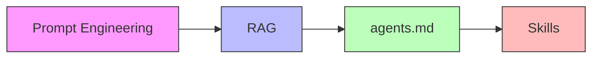
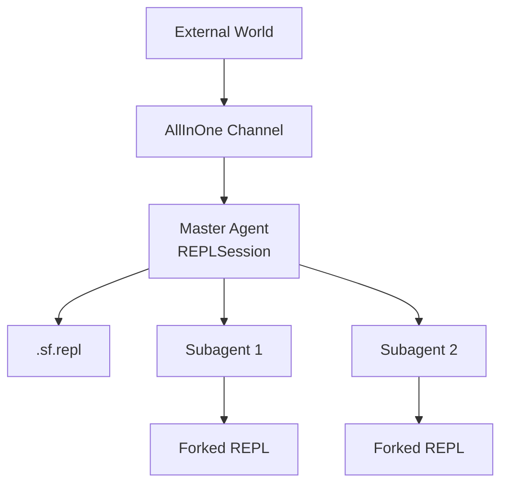
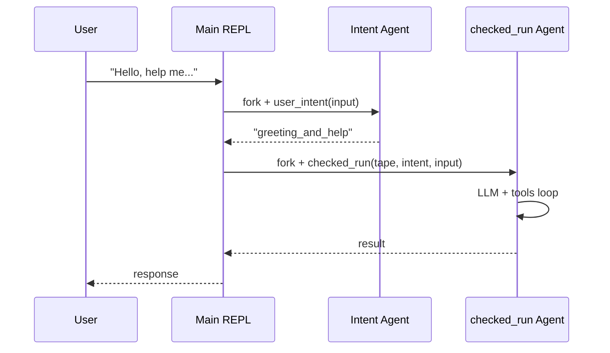

# SystemF

## A Language for Agents

Context is a first-class value

<div @click="$slidev.nav.next" class="mt-12 py-1" hover:bg="white op-10">
  Press Space for next page <carbon:arrow-right />
</div>

<!--
Welcome. Today we're going to talk about SystemF — not the type theory, but a programming language designed specifically for building agents.

The core thesis: context should be a first-class value that you can manipulate, fork, inspect, and compose.
-->

---

# Agenda

1. **What is an Agent?** — From LLM to agentic systems
2. **The Context Problem** — Why managing context is hard
3. **Evolution of Context Management** — How the industry has tried to solve it
4. **Our Approach** — A language where context is a value
5. **Live Demo** — See it in action
6. **Architecture Deep Dive** — How it works under the hood

<!--
We'll go step by step. No jumping ahead.
-->

---
layout: center
class: text-center
---

# Part 1

## What is an Agent?

---

# LLM: A Simple Text Generator

At its core, an LLM is just a function:

```
text(prompt) -> text(response)
```

Two phases:
1. **Prefill** — Process the input prompt
2. **Decode** — Generate output token by token

<br>

<v-click>

That's it. No reasoning, no planning, no memory.
Just: "given this text, what text comes next?"

</v-click>

<!--
This is important to establish. An LLM by itself is just a text completion engine. The magic of "agents" comes from what we wrap around it.
-->

---

# From LLM to Agent

An **agent** = LLM + **loop** + **tools**

```
while not done:
    response = llm(prompt)
    if response wants tool:
        result = execute_tool(response.tool)
        prompt += result
    else:
        return response
```

<v-click>

The LLM can now:
- Read files
- Run commands
- Search the web
- Call other agents

</v-click>

<!--
The agent loop is what makes an LLM useful. It gives the LLM the ability to act on the world.
-->

---

# Agentic Coding Products

| Product | Approach |
|---------|----------|
| **Claude Code** | Editor-integrated agent |
| **Cursor** | AI-powered IDE |
| **GitHub Copilot** | Inline completions + chat |
| **Devin** | Autonomous coding agent |
| **OpenCode** | CLI agent (what we're building on) |

<v-click>

**Common pattern:** All of them wrap an LLM in an agent loop with tools.

</v-click>

<!--
These are the products people know. They all share the same architecture: LLM + loop + tools. The differences are in the integration and toolset.
-->

---

# Common Tools in Agentic Coding

```
┌─────────────────────────────────────┐
│  fs.read    — Read file contents    │
│  fs.write   — Write file contents   │
│  fs.list    — List directory        │
│  bash       — Execute shell command │
│  search     — Search code/text      │
│  edit       — Apply code changes    │
└─────────────────────────────────────┘
```

<v-click>

These are the "basic" tools. Every agent has them.

But there's one **special** tool...

</v-click>

<!--
fs.* and bash are the bread and butter. But the subagent tool is what makes agents truly powerful.
-->

---

# The Special Tool: Subagent

```
subagent(prompt) -> result
```

Spawns a **child agent** to work on a task independently.

<v-click>

**Two key aspects:**

1. **Parallel Execution** — Spawn multiple subagents at once
2. **Context Isolation** — Each subagent gets its own context

</v-click>

<!--
The subagent tool is special because it enables two things that are fundamental to complex agent workflows: parallelization and isolation.
-->

---
layout: two-cols
---

# Parallel Execution

Spawn multiple subagents to work in parallel:

```
research(topic):
    a = subagent("Research " + topic)
    b = subagent("Research edge cases for " + topic)
    return merge(a, b)
```

::right::

# Context Isolation

Each subagent gets a **fresh copy** of context:

```
explore(file):
    # Child sees only what parent gave it
    child = subagent("Analyze " + file)
    # Parent continues with original context
    return child.result
```

<!--
Parallel execution lets you do multiple things at once. Context isolation means the child can't mess up the parent's context.
-->

---
layout: center
class: text-center
---

# Part 2

## The Context Problem

---

# The Core Challenge

Agents need **context** to work:
- Code they're editing
- Conversation history
- Relevant documentation
- Previous tool results

<v-click>

**But context has two constraints:**

</v-click>

<v-click>

1. **Must not be too MUCH** — LLMs have limited context windows
2. **Must not be too FEW** — Missing context leads to wrong decisions

</v-click>

<!--
This is the fundamental tension. You need enough context to make good decisions, but not so much that you exceed the model's limits or drown it in noise.
-->

---

# Context Management is Hard

<v-click>

**Too much context:**
- Exceeds token limit → errors
- Distracts the model → worse decisions
- Slower → more expensive

</v-click>

<v-click>

**Too little context:**
- Forgets earlier decisions
- Repeats work already done
- Makes wrong assumptions

</v-click>

<v-click>

**The problem:** Managing this balance is **manual and opaque**.

</v-click>

<!--
This is where existing tools fall short. They try to manage context automatically, but it's a black box.
-->

---

# Evolution of Context Management



<v-click>

**They are ALL context building.**
Just different mechanisms for the same goal.

</v-click>

<!--
This is an important insight. All these techniques — prompt engineering, RAG, agents.md, skills — are just different ways of building the context that gets sent to the LLM.
-->

---
layout: center
class: text-center
---

# Part 3

## Our Approach

---

# SystemF: A Language for Agents

**What if context management was just... programming?**

<v-click>

Instead of:
- Black-box compaction commands
- Hidden context passing
- Opaque subagent spawning

</v-click>

<v-click>

We provide:
- **Context as a value** — you can pass it around, inspect it, modify it
- **Fork, pass, merge** — first-class operations on context
- **Agent calls as functions** — typed, composable, inspectable

</v-click>

<!--
This is the core pitch. We don't hide context management behind framework magic. We make it explicit and programmable.
-->

---

# Live Demo

## Let's see it in action

```bash
$ cat main.sf
```

<v-click>

```haskell
import bub

{-# LLM #-}
prim_op checked_run :: Tape -> String -> String -> LLM ()

{-# LLM notools noskills #-}
prim_op user_intent :: String -> String

main :: String -> LLM () = \input ->
    let intent = user_intent input 
    in checked_run (current_tape ()) intent input
```

</v-click>

<v-click>

```bash
$ uv run bub chat
> Hello, can you help me with...
```

</v-click>

<!--
This is the simple flow. A SystemF program defines the agent behavior, and the chat command runs it.
-->

---

# Oh My Claw — Reuse the System

The same infrastructure powers **automation**:

<v-click>

**Telegram Notifications**

```bash
# Send alerts from anywhere
curl -X POST http://localhost:8000/event \
  -d "content=disk full" \
  -d "chat_id=alerts" \
  -d "sender=cron"
```

Bub routes it to Telegram. No separate bot setup.

</v-click>

<v-click>

**Systemd Timer Jobs**

```ini
# /etc/systemd/system/backup.timer
[Timer]
OnCalendar=daily
Persistent=true

[Service]
ExecStart=curl -d "sender=cron" \
  -d "chat_id=backup" \
  http://localhost:8000/event
```

Schedule anything. The agent decides what to do.

</v-click>

<!--
This shows the system is not just for coding agents. The same event-driven architecture handles cron jobs, monitoring alerts, and notifications.
-->

---

# Why a Language?

Not a library. Not a framework. A **language**.

<v-click>

**1. Tiered Architecture**

```
┌─────────────────────────────────────┐
│  Hardened Core  (types, evaluator)  │  ← Stable, tested
├─────────────────────────────────────┤
│  Flexible Scripting  (user code)    │  ← Evolve freely
└─────────────────────────────────────┘
```

The core is strict. Your agent logic is flexible.

</v-click>

<v-click>

**2. Deterministic by Default**

Enforced flow = predictable behavior. But we still need **reusable building blocks** for agents to compose — tiered thinking again.

</v-click>

<v-click>

**3. Agents Can Draft Their Own Flows**

Agent traces → distilled flow programs (GEPA). Self-evolving agents that write their own orchestration.

</v-click>

<v-click>

**4. The Ultimate Config**

> "The destiny of all configuration is to become a programming language."

We just skipped the middle steps.

</v-click>

---
layout: center
class: text-center
---

# Part 4

## Architecture Deep Dive

---

# Architecture: Two Key Ideas



**Two key ideas:**

1. **Entrance is the language environment** — `.sf.repl` is the main input
2. **Agent calls are language primitives** — `{-# LLM #-}` functions fork and run

<!--
These are the two architectural innovations. The REPL is not a tool; it's the environment. And agent calls are not framework calls; they're function calls.
-->

---

# Idea 1: The REPL is the Entrance

Traditional flow:
```
User -> Chat Interface -> Agent Loop -> LLM
```

SystemF flow:
```
User -> .sf.repl -> SystemF Program -> Agent Call
```

<v-click>

The **language environment** replaces the chat interface.

Your `main` function *is* the agent.

```haskell
main :: String -> LLM () = \input ->
    let intent = user_intent input 
    in checked_run (current_tape ()) intent input
```

</v-click>

<!--
This is a fundamental shift. Instead of the agent loop being the framework, the agent loop is expressed in the language.
-->

---

# Idea 2: Agent Calls are Primitives

```haskell
{-# LLM #-}
prim_op checked_run :: Tape -> String -> String -> LLM ()
```

<v-click>

When you call `checked_run`:

1. **Fork** a new VirtualREPL from current context
2. **Pass** arguments to the forked repl
3. **Run** the agent loop (LLM + tools)
4. **Return** the result back to parent

</v-click>

<!--
This is the magic. A function call in SystemF can spawn an entire agent with its own context, tools, and execution.
-->

---

# How It Works: The Intention Function

```haskell
{-# LLM notools noskills #-}
prim_op user_intent :: String -> String
```

<v-click>

**What happens under the hood:**

```
1. Fork VirtualREPL from parent
2. Pass argument: "Hello, can you help..."
3. Run LLM with prompt: "Guess user's intent..."
4. Extract return value from forked repl
5. Dispose fork
```

</v-click>

<v-click>

**Result:** `"greeting_and_help_request"`

</v-click>

<!--
This is a lightweight agent call. The notools/noskills pragma means it's a simple text generation, not a full agent loop.
-->

---

# Special: Args and Return with Forked REPL

```
┌─────────────────┐         ┌─────────────────┐
│  Parent REPL    │         │  Forked REPL    │
│                 │         │                 │
│  args = [x, y]  │ ──────► │  Eval: f x y    │
│                 │         │                 │
│  result = ?     │ ◄────── │  get_it()       │
│                 │         │  (return value) │
└─────────────────┘         └─────────────────┘
```

<v-click>

**Key insight:** The forked repl is a **complete execution environment**.

- Arguments are evaluated in parent, passed to child
- Child runs independently (with timeout + cancellation)
- Return value extracted via `get_it()`
- Fork is disposed after call

</v-click>

<!--
This is the mechanism that makes agent calls work. Each call gets a fresh, isolated execution environment.
-->

---

# The Full Flow



<!--
This shows the complete flow. The main program orchestrates agent calls, each in their own forked context.
-->

---

# What This Enables

**Context as a first-class value:**

```haskell
-- Fork a tape for isolated exploration
let branch = fork_tape tape Nothing

-- Run agent in isolated context
summary <- summarize branch "reason"

-- Truncate history and inject summary
tape_handoff tape "reason"
append_message tape summary
```

<v-click>

**You can:**
- Fork context for parallel work
- Inspect and modify context before/after calls
- Build custom compaction logic
- Replay from any point (SQLite tape store)

</v-click>

<!--
This is what makes SystemF powerful. Context is not managed by the framework; it's managed by your code.
-->

---

# Contrast with Existing Tools

| Feature | Claude Code / Others | SystemF |
|---------|---------------------|---------|
| Compaction | `/compact` — opaque | `compact tape "reason"` — visible code |
| Subagents | Tool call — hidden context | Function call — tape is explicit |
| Customization | Prompt tweaks only | Restructure the logic entirely |
| Replay | Can't replay | Tape is data in SQLite — replay from any point |

<!--
This is the summary. The key difference is transparency and programmability.
-->

---
layout: center
class: text-center
---

# Try It Yourself

```bash
git clone https://github.com/emliunix/systemf
cd systemf
uv run bub chat
```

## SystemF — Context is a First-Class Value

[github.com/emliunix/systemf](https://github.com/emliunix/systemf)

<!--
The real demo is the code. It's all in main.sf.
Questions?
-->
