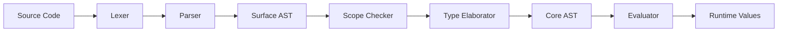

# System F with Algebraic Data Types

A complete implementation of System F (polymorphic lambda calculus) with algebraic data types, featuring bidirectional type inference, pattern matching, and an interactive REPL.

## Features

- **System F Core**: Polymorphic lambda calculus with explicit type abstractions
- **Algebraic Data Types**: Sum types with pattern matching (e.g., `List a`, `Maybe a`, `Either a b`)
- **Bidirectional Type Inference**: Pierce & Turner style with implicit instantiation
- **Interactive REPL**: Type-check and evaluate expressions interactively
- **Primitive Operations**: Integer arithmetic, string operations, and boolean logic
- **Wildcard Types**: Use `_` for inferred type annotations
- **Unicode Syntax**: Support for λ, →, ∀, Λ characters

## Quick Start

```bash
# Run the REPL
uv run python -m systemf.eval.repl

# Load a file
uv run python -m systemf.eval.repl myfile.sf

# Run tests
uv run pytest tests/test_surface/test_inference.py -v
```

## Example Session

```systemf
System F REPL v0.1.0

Loading prelude... (59 definitions)

> 42
it : __ = 42

> True
it : __ = True

> 1 + 2
it : __ = 3

> id : ∀a. a → a = Λa. λx:a. x
id : ∀a. a → a = <function>

> map : ∀a b. (a → b) → List a → List b
> map = Λa. Λb. λf. λxs.
|   case xs of
|     Nil → Nil
|     Cons x xs' → Cons (f x) (map [a] [b] f xs')
| :}
map : ∀a b. (a → b) → List a → List b = <function>
```

## Syntax

### Types

```systemf
-- Primitive types
Int, String, Bool

-- Type variables (implicitly forall-quantified)
a, b, a'

-- Function types
Int → Int, ∀a. a → a

-- Type constructors
List Int, Maybe a, Either a b

-- Wildcard (inferred)
x : _ = 42
```

### Expressions

```systemf
-- Variables and literals
x, 42, "hello", True, False

-- Lambda expressions
λx:a. x, \x:a. x

-- Type abstractions
Λa. λx:a. x, /\a. \x:a. x

-- Applications
f x, f [Int] x

-- Let bindings
let x = 1 in x + 2

-- Pattern matching
case xs of
  Nil → 0
  Cons x xs' → 1 + length xs'

-- Operators
1 + 2, x * y, a == b, n < m
```

### Data Declarations

```systemf
data Bool = True | False

data Maybe a = Nothing | Just a

data List a = Nil | Cons a (List a)

data Either a b = Left a | Right b
```

### Function Declarations

```systemf
-- With type annotation (recommended)
not : Bool → Bool
not = λb. case b of
  True → False
  False → True

-- With wildcard (type inferred)
id : _ = Λa. λx:a. x
```

## Project Structure

```
systemf/
├── src/systemf/
│   ├── core/              # Core AST and type system
│   │   ├── ast.py         # Core language AST
│   │   ├── types.py       # Type definitions
│   │   └── checker.py     # Type checker
│   ├── surface/           # Surface language
│   │   ├── parser/        # Lexer and parser
│   │   ├── inference/     # Type elaborator (bidirectional)
│   │   ├── scoped/        # Scope checker
│   │   └── llm/           # LLM pragma processing
│   ├── eval/              # Evaluator and REPL
│   │   ├── machine.py     # Abstract machine
│   │   ├── repl.py        # Interactive REPL
│   │   └── primitives.py  # Primitive implementations
│   └── utils/             # Utilities
├── tests/                 # Test suite
├── prelude.sf             # Standard library
└── docs/                  # Documentation
```

## Architecture

The implementation uses a multi-pass pipeline:

1. **Parse** → Surface AST (indentation-aware)
2. **Scope Check** → Surface AST with de Bruijn indices
3. **Elaborate** → Core AST with types (bidirectional inference)
4. **Evaluate** → Runtime values



## Key Design Decisions

### 1. Primitive Naming

Primitives are stored **without** the `$prim.` prefix in the AST:
- Source: `prim_op int_plus : Int → Int → Int`
- AST: `PrimOp(name="int_plus")`
- Registry: `PRIMITIVE_IMPLEMENTATIONS["$prim.int_plus"]`

### 2. Type Variable Handling

Type variables flow through the system as:
- Surface: `SurfaceTypeVar("a", loc)`
- Core: `TypeVar("a")` or `TypeMeta(id, name)` for inference
- Bound variables use de Bruijn indices

### 3. Pattern Matching

Pattern matching uses keyword arguments to handle dataclass field ordering:
```python
# Correct
case Abs(var_type=var_type, body=body):
    return VClosure(env, body)

# Incorrect (breaks due to source_loc inheritance)
case Abs(var_type, body):
    return VClosure(env, body)
```

### 4. Wildcard Types

Underscore `_` is treated as a type variable that creates a fresh meta-variable during elaboration, allowing the type checker to infer the concrete type.

## Testing

```bash
# Run all tests
uv run pytest tests/

# Run specific test modules
uv run pytest tests/test_surface/test_inference.py -v
uv run pytest tests/test_eval/test_evaluator.py -v
uv run pytest tests/test_core/test_primitives.py -v

# Run with coverage
uv run pytest tests/ --cov=systemf --cov-report=html

# Run failing tests only
uv run pytest tests/ --lf
```

## REPL Commands

| Command | Description |
|---------|-------------|
| `:quit` `:q` | Exit REPL |
| `:help` `:h` | Show help message |
| `:env` | Show current environment |
| `:load <file>` | Load definitions from file |
| `:{` | Start multiline input |
| `:}` | End multiline input |

## Documentation

📚 **[Complete Documentation Index](docs/INDEX.md)** - Full navigation and search

🚀 **[Getting Started Guide](docs/getting-started/README.md)** - Installation and first steps

📖 **[Syntax Reference](docs/reference/syntax.md)** - Complete language reference

🔧 **[Troubleshooting](docs/development/troubleshooting.md)** - Common issues and solutions

🏗️ **[Architecture Overview](docs/architecture/overview.md)** - System design and components

See [docs/README.md](docs/README.md) for full documentation structure.

## Common Issues

### Parser Error: "expected valid declaration starting with IDENT"

Use explicit type annotations:
```systemf
-- Wrong
x = 42

-- Correct
x : Int = 42

-- Also correct (with wildcard)
x : _ = 42
```

### Type Error: "Undefined variable: 'int_plus'"

Primitives must be loaded from the prelude:
```bash
# Start REPL with prelude
uv run python -m systemf.eval.repl -p prelude.sf

# Or load interactively
> :load prelude.sf
```

### Pattern Matching Issues

Dataclass field ordering affects pattern matching. Always use keyword arguments:
```python
# In evaluator
match term:
    case Abs(var_type=var_type, body=body):  # ✓ Correct
        ...
    case Abs(var_type, body):                 # ✗ Wrong
        ...
```

## Development

```bash
# Install dependencies
uv sync

# Type check
uv run mypy src/systemf

# Lint
uv run ruff check src/systemf

# Format
uv run ruff format src/systemf
```

## Contributing

1. Check `.agents/skills/` for development workflows
2. Write tests for new features
3. Update documentation for API changes
4. Follow the existing code style

## License

MIT
