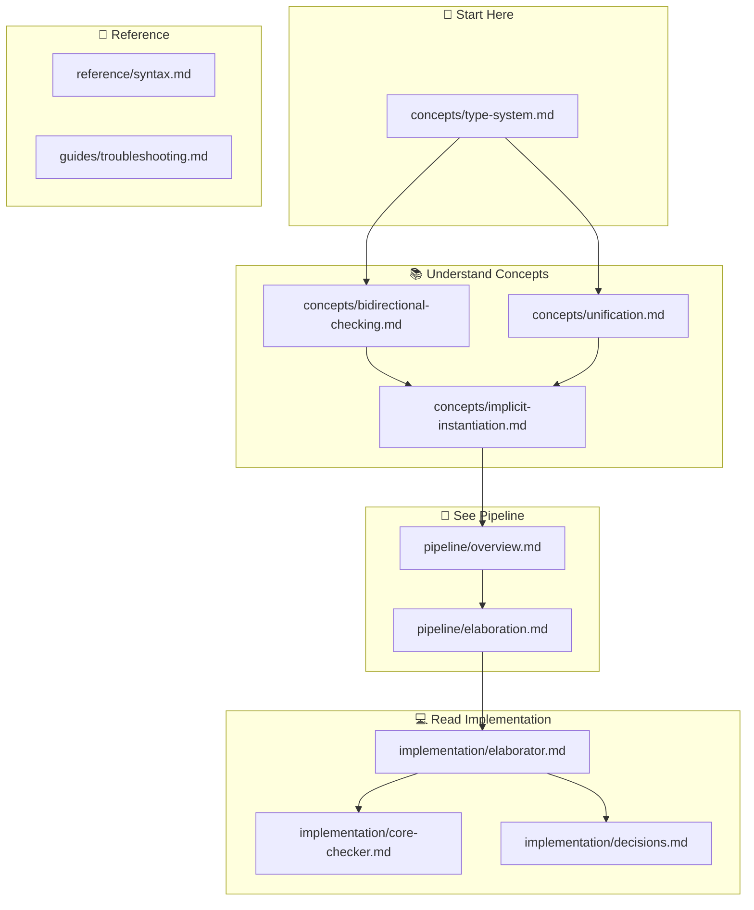

# System F Documentation Index

**Complete navigation guide for all System F documentation.**

Last updated: 2026-03-03

---

## New Documentation Structure (2026-03-03)

We've reorganized the documentation to better explain the relationship between concepts, pipeline, and implementation:

```
docs/
├── concepts/          # Understand the theory first
├── pipeline/          # See how code flows through the system
├── implementation/    # Read the actual code
├── reference/         # Look up specific details
└── guides/            # Get things done
```

---

## Quick Start by Question

| I want to understand... | Read this |
|------------------------|-----------|
| Why does System F have two languages? | [Type System Concepts](./concepts/type-system.md) |
| How does `id 3` infer `Int`? | [Implicit Instantiation](./concepts/implicit-instantiation.md) |
| What's the difference between infer and check? | [Bidirectional Checking](./concepts/bidirectional-checking.md) |
| How does unification work? | [Unification](./concepts/unification.md) |
| How does my code become Core? | [Pipeline Overview](./pipeline/overview.md) |
| How is the elaborator different from the checker? | [Implementation](./implementation/elaborator.md) |

---

## Concepts (Start Here)

**Understand the theory before diving into code.**

### Core Concepts

1. **[Type System](./concepts/type-system.md)** - Surface vs Core distinction
   - Why two languages?
   - What is elaboration?
   - The gap between implicit and explicit types

2. **[Bidirectional Checking](./concepts/bidirectional-checking.md)** - The two-mode type system
   - Inference mode (⇒)
   - Checking mode (⇐)
   - Why bidirectional alone isn't enough

3. **[Unification](./concepts/unification.md)** - Solving type constraints
   - Meta-variables (TMeta)
   - Substitution
   - Robinson algorithm
   - The interleaving with checking

4. **[Implicit Instantiation](./concepts/implicit-instantiation.md)** - How they work together
   - Step-by-step: `id 3` example
   - The interleaving pattern
   - Why this is the right approach

**Reading order**: Type System → Bidirectional → Unification → Implicit Instantiation

---

## Pipeline (How It Works)

**See how your code transforms through the system.**

- **[Overview](./pipeline/overview.md)** - The 3-pass pipeline
- **[Elaboration](./pipeline/elaboration.md)** - Scoped AST → Core AST (detailed walkthrough)

---

## Implementation (The Code)

**Read about the actual implementation.**

- **[Elaborator](./implementation/elaborator.md)** - Extended bidirectional checker
  - Surface elaborator with unification
  - Implicit instantiation
  - Meta-variables

- **[Core Checker](./implementation/core-checker.md)** - Pure bidirectional checker
  - No unification
  - Explicit types only
  - Validates Core AST

- **[Design Decisions](./implementation/decisions.md)** - Why we built it this way
  - Multi-pass architecture
  - All-or-nothing implementation
  - Scoped AST design

- **[Parser Indentation Infrastructure](./implementation/parser-indentation.md)** - Layout-sensitive constraint propagation
  - `ValidIndent` constraint system and `AfterPos` boundary checking
  - Type parser factory function pattern and constraint flow
  - Idris2 theoretical grounding (`continue indents`, `blockEntry`)
  - Implementation record: what changed and why

---

## Reference (Look It Up)

**Quick reference for specific topics.**

- **[Syntax](./reference/syntax.md)** - Language syntax reference
- **[Troubleshooting](./guides/troubleshooting.md)** - Common errors and solutions

---

## Guides (Get Things Done)

**Practical guides for users and contributors.**

- **[Quickstart](./guides/quickstart.md)** - Get started with System F
- **[Contributing](./guides/contributing.md)** - How to extend the system

---

## Visual Navigation Map



---

## Learning Paths

### Path 1: Conceptual Understanding
For those who want to understand **why** it works:

1. [Type System Concepts](./concepts/type-system.md)
2. [Bidirectional Checking](./concepts/bidirectional-checking.md)
3. [Unification](./concepts/unification.md)
4. [Implicit Instantiation](./concepts/implicit-instantiation.md)

### Path 2: Practical Usage
For those who want to **use** the language:

1. [Quickstart](./guides/quickstart.md)
2. [Syntax Reference](./reference/syntax.md)
3. [Troubleshooting](./guides/troubleshooting.md)

### Path 3: Implementation Deep Dive
For those who want to **hack** on the compiler:

1. [Pipeline Overview](./pipeline/overview.md)
2. [Elaborator](./implementation/elaborator.md)
3. [Design Decisions](./implementation/decisions.md)
4. [Contributing](./guides/contributing.md)

---

## Recently Updated

| Date | Document | Change |
|------|----------|--------|
| 2026-03-09 | implementation/parser-indentation.md | New: layout-sensitive type parser constraint infrastructure |
| 2026-03-09 | architecture/elaborator-design.md | Updated for 15-pass multi-pass architecture implementation |
| 2026-03-03 | docs/INDEX.md | Complete reorganization of documentation |
| 2026-03-03 | concepts/*.md | New concept documents explaining theory |
| 2026-03-03 | pipeline/*.md | New pipeline documentation |
| 2026-03-03 | implementation/*.md | Moved and consolidated implementation docs |

---

## Document Status

### Current (Maintained)
- ✅ [concepts/type-system.md](./concepts/type-system.md)
- ✅ [concepts/bidirectional-checking.md](./concepts/bidirectional-checking.md)
- ✅ [concepts/unification.md](./concepts/unification.md)
- ✅ [concepts/implicit-instantiation.md](./concepts/implicit-instantiation.md)
- ✅ [pipeline/overview.md](./pipeline/overview.md)
- ✅ [implementation/elaborator.md](./implementation/elaborator.md)
- ✅ [implementation/parser-indentation.md](./implementation/parser-indentation.md)

### Archive (Deprecated)
- 🗄️ `architecture/` - Moved to concepts/ and pipeline/
- 🗄️ `development/` - Moved to implementation/ and guides/

---

## Key Papers

Theoretical foundations of the implementation:

1. **Pierce & Turner (1998)**: "Local Type Inference" - Bidirectional checking foundation
2. **Dunfield & Krishnaswami (2013)**: "Complete and Easy Bidirectional Typechecking for Higher-Rank Polymorphism"
3. **Robinson (1965)**: "A Machine-Oriented Logic Based on the Resolution Principle" - Unification
4. **Wells (1999)**: Proved System F type inference is undecidable

---

## Maintenance

To update this index:
1. Add new documents to the appropriate section
2. Update "Recently Updated" section
3. Update status if document changes
4. Add to learning paths if relevant
