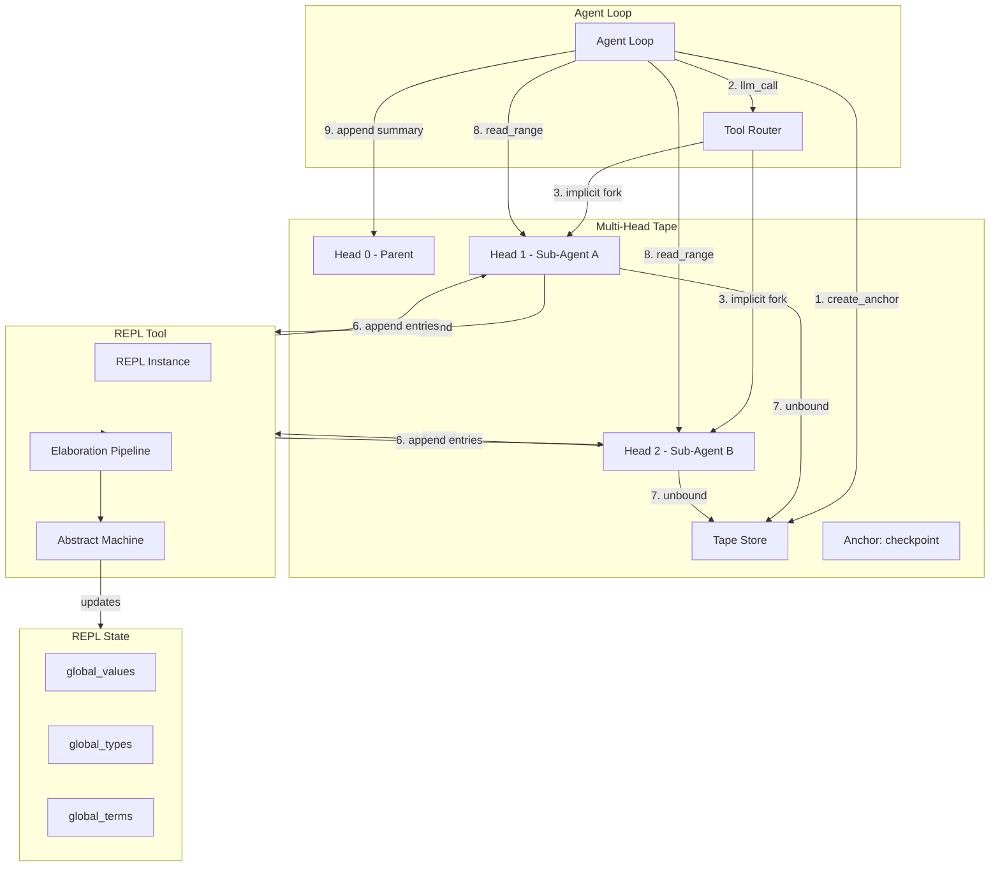

# System F REPL Architecture and Design

**Last Updated**: 2026-03-09
**Status**: Draft
**Related**: [LLM Synthesizer Design](llm-synthesizer-design.md), [Tape Architecture](tape-architecture.md)

---

## Design Update: Tape-REPL-Agent Integration (2026-03-09)

### Summary of Changes

This document has been updated to reflect a new architectural direction: **REPL as a Tool within the Agent Loop, coordinated through a Multi-Head Tape system**. The previous "Virtual REPL Forking" design has been superseded by a unified tape-centric approach.

### Key Design Decisions

| Decision | Status | Rationale |
|----------|--------|-----------|
| **Multi-head tape structure** | ✅ Adopted | Enables parallel exploration without merging complexity |
| **Single-owner heads** | ✅ Adopted | Prevents conflicting appends, simplifies reasoning |
| **Implicit fork on LLM call** | ✅ Adopted | Automatic isolation, no explicit fork API needed |
| **Anchor-driven checkpointing** | ✅ Adopted | `create_anchor()` = mark + advance + get pointer |
| **No automatic merge** | ✅ Adopted | Manual range access keeps design simple |
| **Unbound heads persist** | ✅ Adopted | GC deferred to later, history preserved |
| **VTape as raw tuple** | ✅ Rejected | `(tape_id, head_id, entry_id)` is sufficient |
| **Explicit handoff/merge** | ✅ Rejected | Replaced by multi-head model |
| **Two-layer tape** (Agent + REPL) | ✅ Rejected | Single tape, agent and REPL work mutually exclusively |
| **Head sharing between agents** | ✅ Rejected | Single-owner rule prevents conflicts |

---

## Overview

The System F REPL (Read-Eval-Print Loop) provides an interactive environment for developing and testing System F programs. It operates as a **tool within the Agent Loop**, coordinated through a **Multi-Head Tape system** that enables parallel exploration, checkpointing, and context management.

### Key Characteristics

- **Tool Architecture**: REPL is invoked by agents, not standalone
- **Tape Integration**: All work is recorded to append-only tape with multi-head structure
- **Persistent State**: Definitions accumulate across REPL sessions
- **Incremental Loading**: Files can be loaded progressively with `:load`
- **Type Safety**: All inputs are type-checked before evaluation
- **Fork-Merge Pattern**: Agents spawn parallel explorations via tape forks
- **Single-Owner Heads**: Each head bound to exactly one agent/REPL session

---

## Architecture

### Component Diagram



### Data Flow

```
Agent Turn N:
    1. Agent calls create_anchor("task-start")
       → Append anchor to current head
       → Return (tape_id, head_id, entry_id)
    
    2. Agent issues llm_call(context=anchor)
       → System forks new head from anchor position
       → Binds sub-agent to new head
       → Parent head unchanged
    
    3. Sub-agent works (mutual exclusion with REPL)
       → REPL evaluates expressions
       → Results appended to sub-agent's head
    
    4. Sub-agent completes
       → Head becomes unbound
       → No automatic merge
    
    5. Parent reads ranges from unbound heads
       → Synthesizes findings
       → Appends summary to parent head
```

---

## Tape-REPL Coordination

### Separation of Concerns

**Tape** and **REPL** are distinct systems that coordinate through explicit operations:

| System | Responsibility | State |
|--------|---------------|-------|
| **Tape** | Append-only history, checkpointing, range access | Immutable entries, mutable heads |
| **REPL** | Expression evaluation, type checking, state management | Mutable bindings, types, values |

### Binding Model

**Agent → Head Binding**: An agent is bound to exactly one head. All work is appended there.

**REPL → Head Binding**: REPL is temporarily bound to a head when invoked by an agent. REPL state (bindings, types) is independent of tape state.

```python
class Agent:
    def __init__(self, head: Head):
        self.head = head  # Bound head for appending
        
    def invoke_repl(self, expression: str):
        # REPL uses its own state, not tape state
        result = repl.evaluate(expression)
        # Result appended to agent's head
        self.head.append(Entry(result=result))
```

### Anchor Pointer Tuple

The `(tape_id, head_id, entry_id)` tuple is the only cross-system reference:

```python
AnchorRef = tuple[str, str, int]  # (tape_id, head_id, entry_id)

# Creating checkpoint
anchor: AnchorRef = create_anchor("checkpoint-1")
# Returns: ("tape-1", "0", 42)

# Forking from anchor
def fork_from(anchor: AnchorRef) -> Head:
    """Create new head at anchor position."""
    tape = get_tape(anchor.tape_id)
    return tape.create_head(at_entry=anchor.entry_id)
```

### No State Sharing

**Rejected pattern**: REPL state serialized to tape, restored on resume.

**Adopted pattern**: Tape records history, REPL maintains separate mutable state. When an agent resumes from an anchor, it creates a fresh REPL instance and optionally replays history.

---

## Core Design Decisions

### 1. REPL as Mutable Session State

**Decision**: The REPL maintains mutable state that accumulates across inputs.

**Rationale**: 
> **Design Note**: "System F development is inherently incremental. Programmers build up definitions piece by piece, testing each component before adding the next. A pure functional REPL would require reloading entire modules, destroying the interactive workflow."

**Implementation**:
```python
class REPL:
    def __init__(self):
        # These persist across all inputs
        self.global_values: dict[str, Value] = {}           # term_name -> Value
        self.global_types: dict[str, Type] = {}             # term_name -> Type
        self.constructor_types: dict[str, Type] = {}        # constructor_name -> Type
        self.global_terms: set[str] = set()                 # Track defined terms
        self.ioref_store: dict[str, VIORef] = {}           # Mutable cell storage
```

**Consequences**:
- ✅ Natural interactive development
- ✅ Can reference previous definitions
- ✅ Type context grows incrementally
- ❌ State can become inconsistent (shadowed names, incompatible types)
- ❌ Hard to reproduce exact session state

---

### 2. Module as Immutable Snapshot

**Decision**: The REPL can export its current state as an immutable `Module`.

**Rationale**:
> **Design Note**: "While the REPL is mutable for interactivity, compiled modules should be immutable snapshots. This separation allows the REPL to serve as a 'workspace' that eventually produces a clean, reproducible module."

**Implementation**:
```python
def to_module(self, name: str = "repl") -> Module:
    """Export current REPL state as an immutable module."""
    return Module(
        name=name,
        declarations=self.accumulated_decls,
        constructor_types=dict(self.constructor_types),
        global_types=dict(self.global_types),
        primitive_types=self.primitive_types,
        docstrings=self.docstrings,
        llm_functions=self.llm_functions,
        errors=[],
        warnings=[],
    )
```

**Consequences**:
- ✅ Clean boundary between interactive and compiled code
- ✅ Modules can be saved and shared
- ✅ LLM synthesis registry can be preserved
- ❌ Module export must happen at consistent state

---

### 3. Context Inheritance for Forks

**Decision**: Virtual REPL forks copy parent context by shallow reference.

**Rationale**:
> **Design Note**: "When an LLM operates in a fork, it needs access to all parent definitions. A deep copy would be expensive and break IORef sharing. Shallow copy with shared references provides the right balance."

**Implementation**:
```python
class VirtualREPL:
    def __init__(self, parent: REPL, frozen_types: set[str]):
        # Shallow copy - shared references for IORefs and closures
        self.global_values = dict(parent.global_values)
        self.global_types = dict(parent.global_types)
        self.frozen_types = frozen_types
        
    def define_type(self, name: str, defn):
        if name in self.frozen_types:
            raise TypeError(f"Cannot redefine frozen type: {name}")
        super().define_type(name, defn)
```

**Consequences**:
- ✅ Fast fork creation
- ✅ IORef mutations visible across forks
- ✅ Type definitions shared (immutable)
- ❌ Complex value sharing semantics
- ❌ Potential for unexpected mutations

---

### 4. IORef as Session-Scoped Mutable State

**Decision**: IORefs are mutable cells scoped to the REPL session and shared across forks.

**Rationale**:
> **Design Note**: "Pure functional programming is elegant but impractical for many tasks. IORefs provide controlled mutability for global state (counters, caches, configuration) while maintaining referential transparency for the rest of the program. Session scoping ensures isolation between different REPL instances."

**Implementation**:
```python
@dataclass
class VIORef(Value):
    """Mutable reference cell."""
    name: str
    _value: Value
    _type: Type
    
    def read(self) -> Value:
        return self._value
    
    def write(self, value: Value):
        # Type check at runtime
        if not types_equal(infer_type(value), self._type):
            raise TypeError("IORef type mismatch")
        self._value = value
```

**Module-Level Declaration**:
```systemf
counter :: IORef Int = newIORef 0

increment :: Int → Int
increment n = 
  let old = readIORef counter
      new = old + n
  in writeIORef counter new; new
```

**Consequences**:
- ✅ Familiar mutable state pattern
- ✅ Cross-fork data sharing
- ✅ Useful for caches and counters
- ❌ Loses referential transparency
- ❌ Race conditions possible (no STM)
- ❌ Type safety only at runtime

---

### 5. Command-Based Interface with Modes

**Decision**: REPL operates in distinct modes based on input prefix.

**Rationale**:
> **Design Note**: "Users need both expression evaluation and definition declaration. Trying to guess intent leads to confusing behavior. Explicit modes (command prefix vs expression vs declaration) make the interface predictable."

**Modes**:

| Prefix | Mode | Example |
|--------|------|---------|
| `:` | Command | `:load file.sf`, `:env` |
| `:{` | Multiline | Multi-line declarations |
| None | Declaration | `id :: ∀a. a → a = λx → x` |
| None (fallback) | Expression | `42 + 13` |

**Implementation**:
```python
def process_input(self, line: str) -> None:
    if line.startswith(":"):
        self._handle_command(line)
    elif line == ":{":
        self._start_multiline()
    elif self.multiline_buffer is not None:
        self._accumulate_multiline(line)
    else:
        # Try declaration first, then expression
        try:
            self._process_declaration(line)
        except ParseError:
            self._process_expression(line)
```

**Consequences**:
- ✅ Clear user intent
- ✅ Easy to extend with new commands
- ✅ Multiline support for complex definitions
- ❌ Slight learning curve for new users

---

### 6. Type Inference with Meta-Variables

**Decision**: REPL displays inferred types using meta-variable notation (`__`).

**Rationale**:
> **Design Note**: "Users want to see what types were inferred, but the internal type representation (with TMetas and de Bruijn indices) is unreadable. Meta-variable notation bridges the gap - it shows that a type was inferred without exposing implementation details."

**Example**:
```systemf
> \(x :: Int) → x + 1
it :: __ → Int = <function>
  where __ = Int  (inferred)

> \x → x
it :: ∀a. a → a = <function>
```

**Implementation**:
```python
def format_type(self, ty: Type) -> str:
    """Format type for display, using __ for meta-variables."""
    match ty:
        case TMeta(_) | TypeVar(_):
            return "__"
        case TypeForall(_, _):
            return str(ty)  # Show polymorphic types fully
        case _:
            return str(ty)
```

**Consequences**:
- ✅ Readable type display
- ✅ Encourages type annotations for clarity
- ✅ Polymorphism still visible
- ❌ Loss of precision (multiple metas all show as `__`)

---

### 7. Accumulated Declaration History

**Decision**: REPL maintains ordered list of all declarations for module export.

**Rationale**:
> **Design Note**: "To export a module, we need the complete sequence of declarations in the order they were defined. Shadowing complicates this - we need both the current binding and the history. Accumulating declarations preserves the exact program structure."

**Implementation**:
```python
class REPL:
    def __init__(self):
        self.accumulated_decls: list[Declaration] = []  # History
        self.declaration_map: dict[str, Declaration] = {}  # Current
    
    def add_declaration(self, decl: Declaration) -> None:
        self.accumulated_decls.append(decl)
        self.declaration_map[decl.name] = decl
        # Update current environment
        self.global_values[decl.name] = self._evaluate(decl)
```

**Consequences**:
- ✅ Complete module reconstruction possible
- ✅ Shadowing handled correctly
- ✅ Can replay REPL session
- ❌ Memory grows unboundedly
- ❌ Must garbage collect unreachable definitions

---

## Integration with Elaboration Pipeline

### Flow

```
User Input
    ↓
Parse (Surface AST)
    ↓
15-Pass Elaboration Pipeline
    - scope_pass
    - operator_to_prim_pass
    - inference_pass
    - llm_pragma_pass  ← Creates synthesis context
    - build_decls_pass
    ↓
Core AST
    ↓
Evaluate
    ↓
Update REPL State
```

### Synthesis Registry Integration

The REPL maintains a synthesis registry separate from the evaluator:

```python
class REPL:
    def __init__(self):
        self.synthesis_registry: dict[str, SynthesisContext] = {}
        self.evaluator = Evaluator(self.synthesis_registry)
    
    def load_module(self, source: str) -> None:
        """Load module, registering any LLM functions."""
        module = compile_module(source)
        
        # Register synthesized functions
        for decl in module.declarations:
            if has_llm_pragma(decl):
                context = synthesize_llm_function(decl)
                self.synthesis_registry[decl.name] = context
```

---

## Multi-Head Tape Architecture

### Overview

The tape is an append-only tree structure where each "head" represents an active append point. Heads are single-owner: exactly one agent (or REPL session) can append to a head at any time.

```
Tape Structure:
[A] → [B] → [C] → [Fork Point @ entry_42]
                     │
                     ├──→ [D₁] → [E₁] → [F₁]  ← Head 1 (Agent A)
                     │
                     ├──→ [D₂] → [E₂]          ← Head 2 (Agent B)
                     │
                     └──→ [D₃] → [E₃] → [F₃] → [G₃]  ← Head 3 (Agent C)
```

All heads share the prefix `[A,B,C]`. Divergence occurs at explicit fork points.

### Core Concepts

**Tape**: Immutable, append-only tree of entries. Never modified, only extended.

**Head**: Active append point. Exactly one owner (agent/REPL). Advances with each append.

**Anchor**: Named entry marking a fork point. Created explicitly via `create_anchor()`.

**Entry**: Immutable record (expression, result, anchor, event, etc.).

### Single-Owner Head Rule

**Invariant**: One head = One agent session. Never shared.

```python
# Parent Agent bound to Head-0
tape = create_anchor("exploration-start")
# 1. Append anchor entry to Head-0
# 2. Head-0 advances to anchor
# 3. Return (tape_id, head_id="0", entry_id=42)

# Implicit fork on LLM call
result = llm_call(context=tape)
# 1. System forks Head-1 from anchor position
# 2. Binds Sub-Agent to Head-1
# 3. Parent continues on Head-0 (unchanged)

# Sub-Agent completes
# Head-1 becomes UNBOUND (orphaned)
# No automatic merge, no pull
```

### Agent-REPL Mutual Exclusion

Agent and REPL work mutually exclusively on the same head:

```
Time 0: Agent A active on Head-0
        REPL idle
        
Time 1: Agent A issues REPL command
        → Agent pauses
        → REPL becomes active on Head-0
        → Executes, appends results
        
Time 2: REPL completes
        → REPL pauses
        → Agent A resumes, sees new entries
```

### Anchor Operations

**`create_anchor(name)`** - Mark point and get reference:

```python
anchor = create_anchor("task-start")
# Returns: (tape_id="tape-1", head_id="0", entry_id=current_pos)
```

**`list_anchors()`** - Enumerate all anchors:

```python
anchors = list_anchors()  # ["task-start", "checkpoint-1", "experiment-A"]
```

**`get_anchor(name)`** - Retrieve pointer by name:

```python
anchor = get_anchor("task-start")
# Returns same tuple as create_anchor()
```

### Fork-Merge-Summarize Pattern

When a parent spawns multiple sub-agents for parallel exploration:

```
[Anchor: exploration-start]
    │
    ├── Head-1: Experiment A → [work] → [results-A] → UNBOUND
    ├── Head-2: Experiment B → [work] → [results-B] → UNBOUND
    └── Head-3: Experiment C → [work] → [results-C] → UNBOUND
    │
    [All complete]
    │
    ▼
Parent on Head-0: Read range from Head-1, Head-2, Head-3
    → Appends summary entry to Head-0
    → Continues with clean context + summary knowledge
```

**Note**: No automatic merge. Parent explicitly reads ranges from unbound heads and appends synthesized results to its own head.

### Range Access

Access entries from any head (including unbound):

```python
# Read entries from a range
entries = read_range(tape_id="tape-1", head_id="1", start=0, end=10)

# Or use anchor pointer
tape = get_anchor("experiment-A")
entries = read_range(tape_id=tape.tape_id, head_id=tape.head_id, 
                     start=tape.entry_id, end=current_pos(tape))
```

### Comparison: Old vs New Design

| Aspect | Previous (Virtual REPL) | Current (Multi-Head Tape) |
|--------|------------------------|---------------------------|
| **State isolation** | Deep/shallow copy of REPL state | Fork new head from anchor |
| **Sharing** | Complex reference sharing | Single-owner heads, no sharing |
| **Merge** | Explicit merge with conflict resolution | Manual range read + append |
| **REPL-Tape relation** | VTape captures REPL state | Tape and REPL are separate systems |
| **Fork trigger** | Explicit `fork()` call | Implicit on LLM call with anchor |
| **Cleanup** | Parent manages child lifecycle | Heads unbound, GC deferred |

---

## Commands Reference

| Command | Description | Implementation |
|---------|-------------|----------------|
| `:quit` `:q` | Exit REPL | `sys.exit(0)` |
| `:help` `:h` | Show help | Print command list |
| `:env` | Show environment | Display `global_types` |
| `:load <file>` | Load file | Parse, elaborate, evaluate |
| `:llm` | List LLM functions | Display synthesis registry |
| `:{` | Start multiline | Accumulate lines |
| `:}` | End multiline | Process accumulated |

### Example Session

```systemf
> id :: ∀a. a → a = λx → x
id :: ∀a. a → a = <function>

> id 42
it :: Int = 42
```

---

## Error Handling

### Types of Errors

1. **Parse Errors**: Invalid syntax
2. **Elaboration Errors**: Type checking failures
3. **Runtime Errors**: Evaluation failures
4. **Synthesis Errors**: LLM pragma processing failures

### Recovery Strategy

```python
def process_input(self, line: str) -> None:
    try:
        result = self._do_process(line)
        print(result)
    except ParseError as e:
        print(f"Parse error: {e}")
        # State unchanged
    except ElaborationError as e:
        print(f"Type error: {e}")
        # State unchanged
    except RuntimeError as e:
        print(f"Runtime error: {e}")
        # State unchanged (no partial updates)
```

**Key Principle**: Errors never corrupt REPL state.

---

## Implementation Files

| File | Purpose | Lines |
|------|---------|-------|
| `src/systemf/eval/repl.py` | Main REPL class | ~500 |
| `src/systemf/eval/virtual_repl.py` | Forked REPL | ~200 |
| `src/systemf/eval/machine.py` | Abstract machine | ~400 |
| `src/systemf/eval/value.py` | Value types | ~200 |

---

## Related Documentation

- [LLM Synthesizer Design](llm-synthesizer-design.md) - LLM function synthesis
- [Elaborator Design](elaborator-design.md) - Multi-pass elaboration
- [Type System](type-system-review.md) - Type system overview
- [Tape Architecture](tape-architecture.md) - Tape system design (external reference)

---

## Rejected Design Alternatives

### 1. VTape as Rich Object

**Rejected**: Initially considered `VTape` as a class encapsulating state.

```python
# REJECTED
@dataclass
class VTape:
    session_id: str
    frozen_types: set[str]
    repl_state: VirtualREPL
    thunk: Callable[[], Value]
```

**Reason**: Over-engineering. Simple tuple `(tape_id, head_id, entry_id)` is sufficient. The tape and REPL are separate systems; no need to couple them in a single object.

### 2. Two-Layer Tape (Agent + REPL)

**Rejected**: Considered separate tapes for Agent Loop (high-level decisions) and REPL (low-level evaluations).

**Reason**: Unnecessary complexity. Single tape with multi-head structure handles both layers naturally. Agent and REPL work mutually exclusively on the same head.

### 3. Explicit Handoff/Merge Operations

**Rejected**: Considered explicit `handoff()` and `merge()` operations for context boundaries.

```python
# REJECTED
handoff("phase-complete", state={...})  # Mark boundary
merge(child_tape)  # Combine results
```

**Reason**: Multi-head model makes handoff implicit (fork creates new head). Merge is unnecessary—parent reads ranges and appends summaries explicitly.

### 4. Head Sharing

**Rejected**: Considered allowing multiple agents to append to the same head.

**Reason**: Violates single-owner principle. Creates race conditions and complex synchronization. Fork model provides clean isolation.

### 5. Automatic Pull on Sub-Agent Completion

**Rejected**: Considered automatically pulling results back to parent when sub-agent completes.

**Reason**: Too magical. Explicit range read gives parent control over what to incorporate and how to summarize.

### 6. current_tape() with Implicit Fork

**Rejected**: Considered `current_tape()` returning a live head reference with implicit fork semantics.

```python
# REJECTED - Ambiguous semantics
tape = current_tape()  # Does this snapshot or fork?
```

**Reason**: Ambiguity between "get current state" and "create checkpoint". Explicit `create_anchor()` clarifies intent.

---

## Open Questions

1. **Serialization**: Should REPL sessions be serializable to disk?
2. **Undo**: Should there be an `:undo` command to revert last input?
3. **Profiling**: Should the REPL track evaluation statistics?
4. **Debugging**: Should there be a `:debug` mode with step-through?
5. **Completion**: Should tab completion be supported?
6. **GC Strategy**: When and how to garbage collect unbound heads?
7. **Entry Types**: Need explicit `fork` and `merge` entry types, or just anchors?
8. **Cross-Tape References**: Should ranges reference other tapes, or only within same tape?
